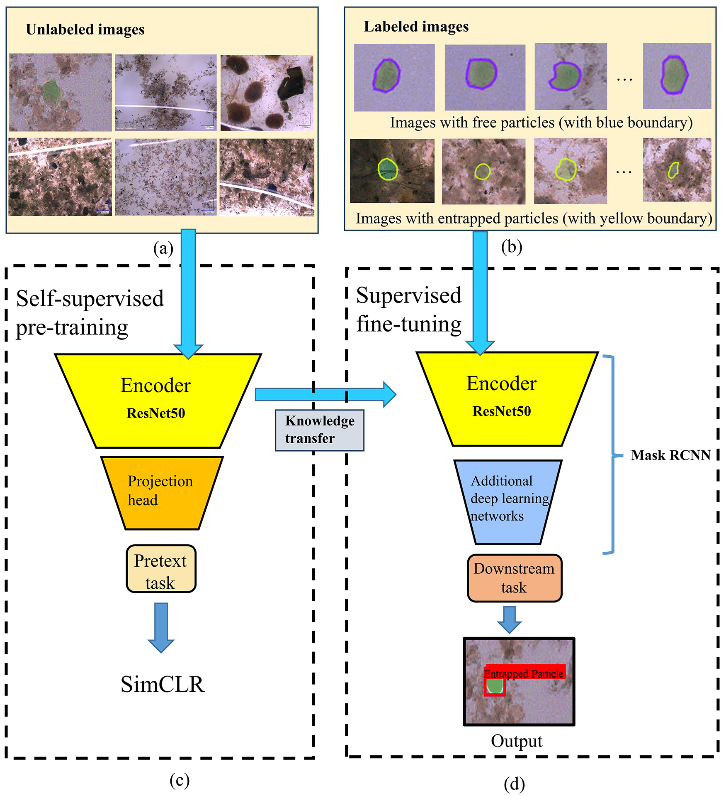

# Semi-supervised learning-based identification of the attachment between sludge and microparticles in wastewater treatment

This repository contains the code used for the following publication:
```bash
  Jia, T., Yu, J., Sun, A., Wu, Y., Zhang, S., & Peng, Z. (2025). Semi-supervised learning-based identification of the attachment between sludge and microparticles in wastewater treatment. Journal of Environmental Management, 375, 124268.
```

The aim of this study is to propose a semi-supervised learning method, based on SimCLR, to detect the attachment between sludge and microparticles in wastewater treatment, and assess its effectiveness and practical applicability. In the first stage, we employed SimCLR to pre-train a ResNet50 network on much unlabeled data. In the second stage, we constructed a Mask R-CNN for instance segmentation by adding additional deep learning layers after the pre-trained ResNet50. Then, we fine-tuned the Mask R-CNN on a small quantity of labeled data, to conduct a specific particle detection and segmentation downstream task in a supervised learning mode. We also test against the same Mask R-CNN architecture trained using supervised learning method alone and ImageNet pre-trained weights. 





Acknowledgement:

This project was inspired by the work of Facebook AI Research and the [Vissl v0.1.6](https://github.com/facebookresearch/vissl) library. 
Learn more about VISSL at [documentation](https://vissl.readthedocs.io). And see the [projects/](projects/) for some projects built on top of VISSL.

## Installation

See [`INSTALL.md`](./INSTALL.md).

## Usage

-  `main_Self_Supervised_Train_.ipynb` is the code for self-supervised learning methods.
- `main_Fine_tune_for_Instance_Seg.ipynb` is the code for fine-tuning the model in a supervised learning method for instance segmentation.
-  `main_Evaluate_Instance_Seg.ipynb` is the code for evaluating model performnaces on test sets for instance segmentation (e.g., AP50, and predicting images).


## Citing this project or paper

If you find this project is useful in your research or wish to refer to the paper, please use the following BibTeX entry.

```BibTeX
@article{jia2025semi,
  title={Semi-supervised learning-based identification of the attachment between sludge and microparticles in wastewater treatment},
  author={Jia, Tianlong and Yu, Jing and Sun, Ao and Wu, Yipeng and Zhang, Shuo and Peng, Zhaoxu},
  journal={Journal of Environmental Management},
  volume={375},
  pages={124268},
  year={2025},
  publisher={Elsevier}
}
```

## Contact

➡️ Tianlong Jia ([T.Jia@tudelft.nl](mailto:T.Jia@tudelft.nl))
